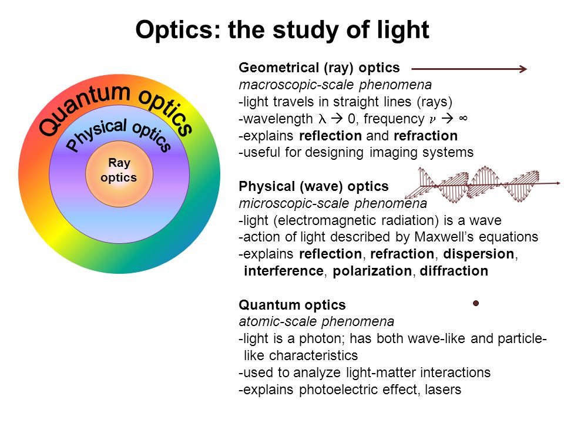
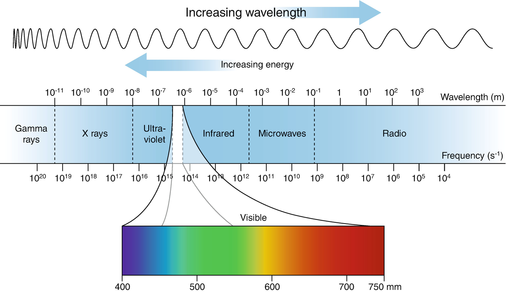

---
markdown:
  image_dir: ./export/img
  path: ./export/1.md
  ignore_from_front_matter: true
  absolute_image_path: true
---
@import "./_style.less"


<!--
光源, 相机, 颜色, 光谱, 辐射度


<p class="figure">  </p> 
-->


<!--暂时没找到题图, 先替代一下-->

# pbrt-v3 阅读笔记(一): 光线, 光源和相机


<p class="figure"> 维基百科上的原图是 svg 格式的, 可以使用矢量编辑器修改 </p> 

上一篇文章里我们简要介绍了 PBR 中包含的种种视觉效果, 从本篇文章开始, 我们会逐步去探索它们背后包含的原理, 以及 pbrt-v3 中对应的代码实现. 这里笔者对维基百科中的示意图做了一些[修改](https://vectr.com/infancy/d1TQadd), 它将成为后续分析的基础

上文中各种视觉效果的理论和实践有难有易, 为了简单起见, 我们就从最简单的情况来开始分析

## 场景一: 只包含光源(和相机)


<!--需要的时候再加上解释-->

我们先把场景中的所有物体拿掉, 只保留光源, 这样就只需要考虑相机和光源的关系了


更简单一点的, 我们只关注下面这三个主体就好了:


<p class="figure"> 这里遵循了光线追踪算法中的惯例, 让光线从相机指向光源, 与现实是相反的 </p> 

在这个场景里, 右边的光源不断向外发射出光线, 左边的相机接受光线并生成图像. 这看起来比较无聊, 但如果能先把光源和相机, 以及它们中间的光线分析清楚, 对之后的文章会很有帮助

<!--

- 有一个光源, 光源不断向外发射出电磁波(辐射能量), 当然, 在渲染图像时我们只关心电磁波里可以被人类感知的那一段, 也就是可见光;
- 图形学中最常用的光学模型是几何光学模型(也就是我们中小学时接触的光学模型), 这个模型足以描述 PBR 中的大部分的光学现象

#### 从光源射向相机的光线

在上一小结, 我们简单介绍了成像原理, 以及光和颜色的关系, 下面

人眼所能看到的光, 是电磁波中 300nm 到 700nm 左右的一段, 也就是可见光是电磁波的一个子集. 那么电磁波具有什么样的属性呢? 频率和波长.

这个时候如果再联系光谱图, 

首先简单来说, 我们能看见物体, 是因为光线或经由空间中的介质(空气, 水)传播直接进入到了人眼, 或经由物体表面的反射, 折射间接照射到人眼

### 相机, 成像平面
-->


## 光线(ray)
<!--
电磁波, 频率, 波长
光量子
单色光, 光谱图
计算机的处理
-->

光线对于整套渲染系统来说, 就像电流, 血液一样. 在解释光源是如何发射光线, 相机接收光线之前, 我们先来看看光线到底是什么.

首先当说到"光线"这个词时, 我们就已经把光(light)抽象成了一条直线(ray), 或者说光是沿直线传播的. 在日常生活中, 很多时候光线就是光的代名词, 因为光线是一个很直观的几何模型, 可以解释生活中很多常见的光学现象(反射, 折射, 阴影等). 在之后的内容中, 笔者也会不自觉的混用光和光线.


<p class="figure"> https://slideplayer.com/slide/10640780/ </p> 

随着十七世纪以来光的波动学说和粒子学说的发展演化, 人们对光有了新的认识. 十九世纪建立的电磁波理论, 表明了光是一种电磁波, 但同时期发现的光电效应, 则无法用波动模型来解释. 一直到二十世纪初, 随着普朗克常数, 光子假说的确立, 光的波动性和粒子性得到了统一(也就是光的波粒二象性).

至此, 有了三种模型来描述光的性质: 几何模型, 波动模型和粒子模型. 当我们需要解释日常生活中的现象时, 光线(反射, 折射)或者光波(干涉, 衍射, 偏振)足矣, 粒子模型往往在解释微观现象(微观粒子的那个级别)时才会用到.

为了解释下文中光的很多性质, 下面就先来解释一下电磁波和可见光.


// 小孔成像, 光(light)是什么

### 电磁波和可见光


<p class="figure"> https://upload.wikimedia.org/wikipedia/commons/f/f1/EM_spectrum.svg </p> 

上文说到, 光是电磁波, 这意味着光可以具有不同的频率和波长, 但人眼并非能感知到所有频率的光, 因此当我们提到光时, 一般指的是电磁频谱中, 400nm ~ 700nm 之间的这段, 也就是可见光. 考虑这上图是非线性的, 所以可见光只是电磁波中非常小的一段, .

引用

(如果你问我在渲染的时候, 把可见光当成波还是粒子, 嗯...按照几何光线的观点, 把它看做是一条线就行了)

#### 传递方式
<!--辐射-->

光可以在介质中传播, 我们看到的是介面.
以辐射的方式传播(核辐射, 电磁辐射)

类似的, 热辐射, 声辐射

可见光是电磁波中的一小段, 光线是几何光线中的一种模型

#### 电磁波的性质波长分布和频率高低 
<!--光谱-->


#### 功率大小
// 能量的载体

<!--辐射功率-->

<!--譬如我们说中午的阳光特别刺眼, 实际上是因为-->
譬如一个 100w 的探照大灯要明显比日常用的 25w 节能灯要亮得得多; 又或者当我们调高显示器的亮度时, 其实也是增大它向外辐射的功率.
而在渲染时, 我们是一帧一帧, 在一个时间点上渲染的, 所以在渲染时, 我们更关心的是不是可见光的总能量, 而是它单位时间辐射的能量, 也就是可见光的功率大小.


### 点到为止

至此, 我们知道了可见光的一些基本属性, 和定量描述分析它们的方法. 当然, 还有很多没有涉及的地方, 
目前介绍的内容足够我们继续来讲相机, 光源了

考虑到并没有什么常见的光学现象需要拿光的粒子性来解释, 而干涉, 衍射等现象也并不多见, 很多时候都会忽略掉他们. 所以在图形学中最普遍使用的就是光的几何模型.

### 资源和引用

* 模拟程序
  * [几何光学模拟](https://ricktu288.github.io/ray-optics/)
* 维基百科
  * [optics](https://en.wikipedia.org/wiki/Optics)([光学](https://zh.wikipedia.org/zh/%E5%85%89%E5%AD%A6))
  * [light](https://en.wikipedia.org/wiki/Light)
  * [ray](https://en.wikipedia.org/wiki/Ray_(optics))([光](https://zh.wikipedia.org/wiki/%E5%85%89))

* [由浅入深学习PBR的原理和实现 - 四. 进阶：PBR核心理论和原理](https://www.cnblogs.com/timlly/p/10631718.html#%E5%9B%9B-%E8%BF%9B%E9%98%B6%EF%BC%9Apbr%E6%A0%B8%E5%BF%83%E7%90%86%E8%AE%BA%E5%92%8C%E5%8E%9F%E7%90%86)


## 光源 I
<!--
发射能量
感觉可以前置一点, 放到成像原理后面

通过发热, 电离等方式

-->

### 太阳
<!-- 全光谱 -->


太阳的辐射通量非常高, 

### 灯泡
<!-- 部分光谱 -->

#### 白炽灯

#### LED 灯

### 激光


其实日常生活还要一个很重要的"光源", 那就是显示器, 但这个我们留到后面再说


### 单色光(monochromatic light)和复色光

### 光谱图(spectrogram)

#### 光谱上的功率分布情况

<details><summary><b>* 拓展</b></summary><p>

#### * 测量光谱的功率分布
</p></details>


#### 实践: 离散采样

可见光光谱是连续的, 我们可以对它进行离散采样, 生成离散化的数据给计算机处理.
离散化的一组采样光谱, 用代码表示就是

```C++


```

### 资源和引用


## 相机的成像原理
<!--
接收能量
-->

* 相机是怎么成像的?
* 人眼是怎么成像的?

### 1. 针孔相机

// 在分析人眼之前, 我们不妨先来看看相机的成像原理

当然, 在实际开发时, 我们一般把图像平面 Film 放在 Camera 前面, 这样更方便计算

<details><summary><b>* 拓展 </b></summary><p>

针孔相机确实是可以工作的

</p></details>


### 2. 数码相机
<!--
通过对数码相机的介绍建立相机成像的模型, 这一模型也将适用于包括在人在内的许多动物身上
-->

虽然针孔相机也可以工作, 但现实中常用的数码相机, 一般是采用薄透镜模组作为

图像处理器: 光信号转换为电信号

<!--
数码相机的简单理解
薄透镜
DCC, CMOS 传感器的工作原理

上面是一张人眼的示意图, 晶状体, 视网膜...比较, 我们可以直观的看到, 人眼的成像其实类似于数码相机, 视网膜接受到光信号后, 由大脑形成最后的视觉, 也就是各种各样的颜色. 这里有一点非常重要, 那就是颜色是在人的视觉中枢中形成的, 视网膜上接受的只是一段电磁波而已.
-->

### 3. 不同动物的视觉

是的, 这里我们把动物的眼睛也当作一个"相机"来分析.

### 4. 人的视觉

在简单分析了数码相机的成像原理后, 我们来看看人的视觉是如何工作

人眼的成像原理.


外界的光信号最后会, 最后光线汇聚到眼球后方的视网膜上


在这之后, 视网膜还会继续通过, 将传送给视觉神经中枢, 在视觉中枢中才会形成最后的视觉. 在这个过程中, 眼球同时承担了收集和采集光信号的作用.


<p class="figure"> 数码相机的传感器应该集成在主板上, 左侧 '3' 代表的导线只是方便示意而已 </p>

我们可以通过上面这张图来比较数码相机和人类的视觉系统, 两者有很大的相似之处, 都通过一个镜头(薄透镜/视网膜)收集光信号, 通过传感器(图像传感器/视网膜)采集信号, 处理器(图像处理器/视觉神经中枢)来处理信号. 当然, 以上都是简略的分析, 还有很多细节未涉及到.

<details><summary><b>* 拓展</b></summary><p>
</p></details>


在这里笔者想强调一个重点, 那就是视觉是在视神经中枢形成的, 我们所看到的五颜六色的世界, 眼球接受到的仅仅只是光信号而已, 换句话说, **颜色是人的主观感觉, 可见光并不是颜色**

<!--
不知道读到这里, 您会不会有一点反应不过来, 
-->
笔者在第一次认识到这一点时, 是有点反应不过来的, 毕竟无论是自己长期的生活经验, 还是中学的光学课程, 都让笔者形成了可见光就是颜色的看法, 忽然要重新认识这两者的关系, 打破以往长期的生活经验, 还是有点不适应的.(多少有点像第一次听到相对论的概念一样)

如果您也有类似困惑的话, 请继续阅读

### 视网膜

这里不妨多举几个例子, 譬如狗只有..., 只能看到黑白的世界; 墨鱼/鸟类的视网膜上有四种感光细胞, 可以感知到更多的光线, 有比人眼更丰富的颜色; 蜜蜂能看到紫外线, 帮助它们寻找花粉...

<!--
**可见光是客观存在的**, 是空间中的一段电磁波. 而大千世界的生物具体感知到了什么, 则取决于它们自己, 具体到人类, 看到了颜色, **颜色是人的主观感受**

不过为了实现基于物理的渲染, 与笔者有着类似观念的读者们, 需要好好重新认识可见光和颜色的关系
-->

<!--
颜色/能量/光谱/SPD
-->


## 颜色是什么
<!--瞬间的能量分布, 严格一点来说, 就是单位时间的能量(不用一开始详细的讲)-->


回到之前介绍可见光的这张图, 笔者觉得这张图有个很大的误导(虽然它又符合我们平常的认知), 那就是给不同频率的可见光标上了颜色, 虽然这表明的只是人眼看到这些频率光线的反应, 却很容易当成"这个频率的光线具有这样的颜色".


### 光谱表示太复杂，有没有简单的方法
<details hidden><summary></summary>

#### > 颜色匹配 Color Matching
</details>

<!--
光不是颜色, rgb 也不是颜色
光到颜色, 是多维到三维的映射, rgb 到颜色, 是三维到三维的矩阵变换, 某些情况下需要负值的 RGB 才能变换到 SML
-->

早在xxxx年, 人们就意识到只需要几种简单的颜色, 就可以调配处人眼可见的绝大多数颜色,
根据上一节人眼等成像设备的工作原理(全光谱映射成一个标量值), 

我们通过**颜色匹配**实验, 认识到了**异谱同色**现象.


### 三色理论 Tristimulus Theory of Color

Spectral response of human cone cells (S, M, L) , 而不是 RGB

### 简单的方法也分很多种
<details hidden><summary></summary> 

#### > 颜色空间
</details>


<details><summary><b>* 拓展</b></summary><p>

</p></details>


### 色度学


### 结语

因为光和颜色的联系过于紧密, 之后的文章中, 可能有时不经意就会将光称作颜色, 或者是反过来, 您需要根据当时的语境(上下文)来理解它所代表的含义.

### 资源和引用

* [Basic Color Science for Graphics Engineers](https://agraphicsguy.wordpress.com/2018/11/29/basic-color-science-for-graphics-engineers/)


## 辐射度学和光度学

### 纯物理的辐射度
<!--全光谱, 客观-->

辐射能: 以辐射的方式传递的能量
辐射通量: 也就是辐射功率
辐射照度: 简称辐照度, 功率密度, 也就是单位面积上的功率大小
辐射亮度: 简称辐射度, 单位面积在单位方向上的功率大小

<!--
辐射强度尽量略过吧???
-->


早晨和中午的太阳光

人眼感知到的是辐射度


### 将人的视觉纳入考虑的光度学
<!--可见光谱, 主观-->


## 光源 II

在之前颜色那一节, 我们介绍了颜色匹配实验和异谱同色现象, 显示器正是依靠这些事情背后的原理来工作的. 

...所以在渲染中, 全光谱的光源不是必须的, 我们用一个三色光源也可以渲染

### *显示器
<!-- RGB -->
<!-- 虽然嘴上讲要面向读者, 但还是 -->

因为人眼上单类色锥细胞只能感受到一个标量值, 根据颜色的三刺激理论, 
日常的显示器用 RGB 发光光源来模拟色谱...

#### *CRT 显示器

#### *LED 显示器

#### *OLED 显示器


光源暂且没什么好讲的, 就是在不停向外辐射能量

根据颜色的三刺激理论, 基于采样光谱的光源, 也可以用基于 RGBSpectrum 的光源来模拟


## 回顾场景一


现在再来看场景一, 我们知道了 

<!--
怎么介绍自发光呢, 放场景二讲完区域光源后再说
-->

## small pbrt v1

现在我们来尝试用简化过的 pbrt 中的代码来模拟场景一

## 资源和引用

[]()